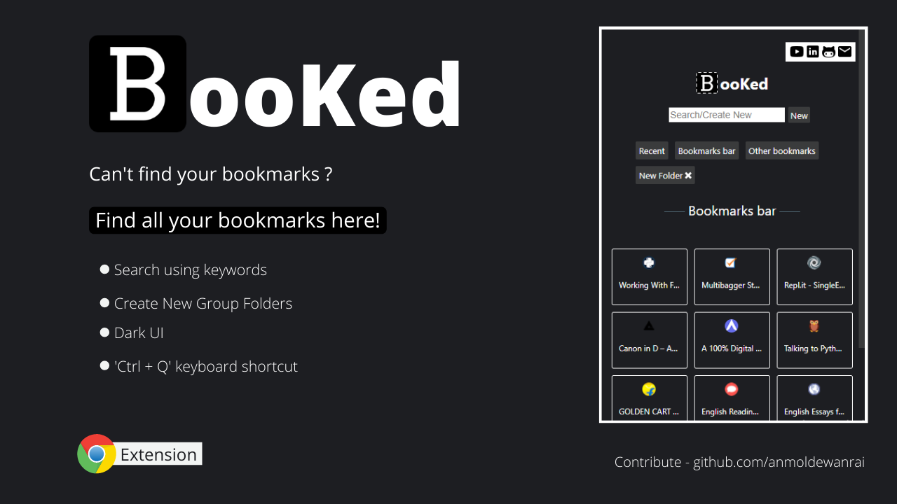

# BooKed ⭐

### Find and Manage Bookmarks Efficiently

### [Add to your chrome]

```
Open to feature suggestions!
```

## Overview



## What is BooKed ❓

- A chrome extension to find and manage all your bookmarks for easy access by the user!

- [See Demo Here]

- Find all your Bookmarks
- Search using keywords
- Group them up in categories
- Ctrl + Q keyboard shortcut
- Single click to open

- **Chrome bookmark's does the exact same thing then why Linkpad?**

  - Finding the desired Bookmark is just like finding a needle from hay. You'll eventually get it'll cost you everything.

## Work Under Progress 🛠

- [ ] Light Mode
- [ ] Edit Bookmark Name & Link
- [ ] Re-arrange Bookmarks
- [ ] List View
- [ ] Sorting Options
- [ ] Undo After Delete

## Want To Contribute 🤝 ?

- You can clone and change code to your needs.
- I suggest you to use sandbox **dist\popup.js** before contributing.
- Self Explanatory Codebase
- Well Commented (PS: Don't Trust Them completely though)
- For any clarification on code you can raise a issue or find me here.
- [Gmail] / [Twitter] /[LinkedIn]

[gmail]: mailto:anmoldewanrai@gmail.com
[linkedin]: https://www.linkedin.com/in/anmolraidewan/
[add to your chrome]: link
[see demo here]: link
